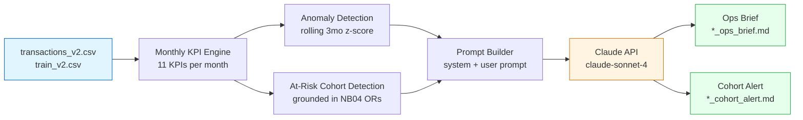

<div align="center">
  <!-- PLACEHOLDER #1: KKBox logo / project banner -->
  
</div>
<h1 align="center">KKBox Subscription Churn Analysis &amp; Automated Insight Pipeline</h1>

<table align="center">
  <tr>
    <td width="1440">
      <h2 align="center">Client Background</h2>
      <body>
        <strong>KKBox</strong> is Asia's largest music streaming service, operating across Taiwan, Hong Kong, Malaysia, Singapore, and Japan. Like every subscription business, KKBox's revenue depends on a simple question: <strong>does the user renew, or do they walk?</strong> In this dataset, a user is labeled <code>is_churn = 1</code> if they do not renew within 30 days of their subscription expiring.
        <br><br>
        The working dataset, sourced from the <a href="https://www.kaggle.com/c/kkbox-churn-prediction-challenge/data">KKBox Churn Prediction Challenge</a> on Kaggle, covers roughly <strong>6.7 million members</strong>, <strong>1.43 million transactions</strong> (Jan 2015 &ndash; Mar 2017), <strong>~30 million daily listening logs</strong>, and <strong>~970K labeled churn outcomes</strong>.
        <br><br>
        This project was scoped as a data analyst deliverable, not a Kaggle leaderboard run. The goal was not to squeeze another 0.1% AUC out of a model &mdash; it was to answer the business questions a retention team actually asks each month, and to <strong>automate the reporting layer</strong> so those answers scale without analyst bottleneck.
      </body>
      <h3>Northstar Metrics</h3>
      <h4>
        <ul>
          <li><strong>Churn drivers:</strong> Which user behaviors most strongly predict non-renewal, and by how much?</li>
          <li><strong>At-risk cohorts:</strong> Who is vulnerable <em>this month</em>, and what action should retention take?</li>
          <li><strong>Monthly KPI monitoring:</strong> How do subscription, revenue, and engagement metrics trend, and when do they break from baseline?</li>
          <li><strong>Analyst scale:</strong> Can an LLM-powered pipeline turn raw monthly data into stakeholder-ready briefs without an analyst drafting them by hand?</li>
        </ul>
      </h4>
    </td>
  </tr>
</table>

<table align="center">
  <tr>
    <div width="920">
      <h1 align="center">Executive Summary</h1>
      <h3 align="center">Churn Driver Odds Ratios (Logistic Regression, AUC = 0.9665)</h3>
      <div align="center">
        <!-- EXISTING IMAGE: churn_drivers.png (from NB04 -- odds ratio bar chart) -->
        
      </div>
      <td width="460" valign="top">
        <ol>
          <li>
            <strong>Recency of activity is the single strongest churn signal.</strong>
            <ul>
              <li><code>days_since_last_txn</code> has an odds ratio of <strong>15.29</strong> &mdash; users inactive in the window before expiry are ~15x more likely to churn.</li>
              <li>This dwarfs every other feature in the model and is the most actionable lever for retention outreach.</li>
            </ul>
          </li>
          <li>
            <strong>Cancellation history compounds.</strong>
            <ul>
              <li>Each prior cancellation carries an odds ratio of <strong>4.92</strong>.</li>
              <li>The <code>high_cancel_flag</code> (2+ cancellations) <strong>dampens</strong> the marginal signal once captured (OR = 0.73), confirming the features are doing the right thing rather than double-counting.</li>
            </ul>
          </li>
        </ol>
      </td>
      <td width="460" valign="top">
        <ol start="3">
          <li>
            <strong>Auto-renew is the most effective retention mechanism in the data.</strong>
            <ul>
              <li><code>auto_renew_rate</code> OR = <strong>0.45</strong>: users on auto-renew are ~55% less likely to churn.</li>
              <li>This is the clearest win for retention ops &mdash; re-enrolling the no-auto-renew cohort would move the needle more than any new acquisition channel.</li>
            </ul>
          </li>
          <li>
            <strong>Discounts buy users that don't stay.</strong>
            <ul>
              <li><code>avg_discount_pct</code> OR = 1.48: discount-reliant users churn 48% more than full-price users.</li>
              <li>Implication: discount promotions should be measured on Day-90 retention, not just sign-up lift.</li>
            </ul>
          </li>
        </ol>
      </td>
    </div>
  </tr>
</table>

<h2 align="center">Dataset Structure</h2>
<body>
The analysis draws on four joined sources: member demographics, subscription transactions, daily listening logs, and churn labels. Below is the schema after cleanup and merging.
</body>
<div align="center">
  <!-- PLACEHOLDER #2: ERD / schema diagram showing the four source tables joined on msno (user ID) -->
  
</div>

<table align="center">
  <tr>
    <td>
      <strong>Source tables</strong>
      <ul>
        <li><code>members_v3.csv</code> ~6.7M rows. Demographics (age, gender, city, registration channel).</li>
        <li><code>transactions_v2.csv</code> ~1.43M rows across 868K users. Plan length, price paid, auto-renew flag, cancel flag.</li>
        <li><code>user_logs_v2.csv</code> ~30M rows / 1.4 GB. Per-user daily listening: unique songs, seconds played, completion breakdown.</li>
        <li><code>train_v2.csv</code> ~970K labeled users (<code>is_churn</code> = 1 if no renewal within 30 days of expiry).</li>
      </ul>
    </td>
  </tr>
</table>

<h1 align="center">Technical Stack</h1>
<table align="center">
  <tr>
    <td width="333" valign="top">
      <h3>SQL (PostgreSQL)</h3>
      <ul>
        <li>Cohort feature engineering on the transactions and user logs tables.</li>
        <li>Window functions (<code>LAG</code>, <code>ROW_NUMBER</code>, <code>RANK</code>), CTEs, date arithmetic with <code>DATE_TRUNC</code>, conditional aggregates using <code>FILTER</code>.</li>
        <li>Output: an 11-column, 933,578-row feature table pulled into pandas via <code>sqlalchemy</code>.</li>
      </ul>
    </td>
    <td width="333" valign="top">
      <h3>Python</h3>
      <ul>
        <li><strong>pandas / NumPy:</strong> chunked ingestion of the 30M-row user logs, vectorized slope computation for listening decay.</li>
        <li><strong>scikit-learn:</strong> logistic regression for interpretable churn driver analysis.</li>
        <li><strong>matplotlib:</strong> monthly KPI dashboard and diagnostic plots.</li>
      </ul>
    </td>
    <td width="333" valign="top">
      <h3>AI Automation</h3>
      <ul>
        <li><strong>Anthropic Claude API</strong> wired into a monthly reporting pipeline.</li>
        <li>System / user prompt separation, two brief types, two tone modes (exec vs. full).</li>
        <li>Pipeline still runs and saves the prompt payload for review. Even without being connected to the Anthropic API</li>
      </ul>
    </td>
  </tr>
</table>

<h1 align="center">Insights Deep-Dive</h1>

<table align="center">
  <tr>
    <h1 align="center">Churn Drivers</h1>
    <td width="1000">
      <!-- EXISTING IMAGE: roc_curve.png -->
      
    </td>
    <td width="1000">
      <!-- EXISTING IMAGE: feature_importance_preview.png -->
      
    </td>
    <td width="1000">
      <!-- EXISTING IMAGE: correlation_heatmap.png -->
      
    </td>
  </tr>
</table>

<table>
  <tr>
    <td>
      <strong>Model framing</strong>
      <ol>
        <li>Logistic regression was chosen <strong>for interpretability</strong>, not for accuracy.
          <ul>
            <li>Every coefficient converts to an odds ratio a PM or retention lead can read in one sentence.</li>
            <li>AUC came in at <strong>0.9665</strong>, strong discriminatory power without sacrificing the narrative.</li>
          </ul>
        </li>
        <li>Features were audited before fit.
          <ul>
            <li><code>plan_days_last</code> was dropped, it collapsed into the plan-length one-hots and produced a tell-tale OR of 0.000039 on <code>plan_30d</code>.</li>
            <li><code>plan_30d</code> was then used as the one-hot reference category, <code>log_engagement_score</code> dropped to avoid restating two features already in the model, and <code>auto_renew_last</code> dropped in favor of the richer <code>auto_renew_rate</code>.</li>
          </ul>
        </li>
      </ol>
      <strong>Top signals (odds ratio)</strong>
      <ol>
        <li><code>days_since_last_txn</code> &mdash; <strong>OR 15.29</strong>. Largest effect in the model. Inactivity before expiry is the single most reliable early warning.</li>
        <li><code>num_cancellations</code> &mdash; <strong>OR 4.92</strong>. Prior cancellations almost 5x the odds of churn.</li>
        <li><code>avg_discount_pct</code> &mdash; OR 1.48. Discount-dependent users are consistently higher risk.</li>
        <li><code>log_days_last_30</code> &mdash; OR 1.21. Low recent listening activity still adds signal even after recency is accounted for.</li>
        <li><code>auto_renew_rate</code> &mdash; <strong>OR 0.45</strong>. The only strong <em>protective</em> feature &mdash; auto-renew users are 55% less likely to churn.</li>
        <li><code>high_cancel_flag</code> &mdash; OR 0.73. Absorbs some of the cancellation signal once the count feature is in the model.</li>
      </ol>
      <strong>Feature engineering callout &mdash; listening decay slope</strong>
      <ol>
        <li>The 30M-row listening log had to be collapsed into a single per-user slope: how fast is their weekly listening time trending in the four weeks before expiry?</li>
        <li>A Python loop was too slow. The working solution was a <strong>chunked pandas groupby</strong> (500K rows per chunk) into a per-user / per-week pivot, then a vectorized least-squares slope computation across the pivot in NumPy.</li>
        <li>Result: <code>listening_decay_slope</code> joins cleanly into the feature table without ever loading all 30M rows into memory.</li>
      </ol>
    </td>
  </tr>
</table>

<table align="center">
  <tr>
     <h1 align="center">Monthly KPI Monitoring</h1>
      <div align="center">
        <h3>6-Panel KPI Trend Dashboard (Pipeline Output)</h3>
        <!-- EXISTING IMAGE: monthly_kpi_trends.png (produced by NB05) -->
        
      </div>
  </tr>
</table>

<table align="center">
  <tr>
    <td width="333" valign="top">
      <h3>KPIs Tracked</h3>
      <ul>
        <li>Transaction volume, unique active users, auto-renew rate, cancel rate, total and average revenue.</li>
        <li>Discount rate, share of 30-day plans, non-renew rate, and a composite <strong>churn pressure</strong> score.</li>
        <li>Each KPI is recomputed monthly from raw transactions, no manual input.</li>
      </ul>
    </td>
    <td width="333" valign="top">
      <h3>Anomaly Detection</h3>
      <ul>
        <li>Rolling 3-month baseline per KPI, z-score computed against it.</li>
        <li>Any month where <code>|z| &gt; 2</code> gets flagged and explicitly called out in the brief.</li>
        <li>Example: Jan 2017 flagged a +63% jump in transaction volume and a +108% jump in auto-renew rate vs. the 3-month baseline.</li>
      </ul>
    </td>
    <td width="333" valign="top">
      <h3>At-Risk Cohort Detection</h3>
      <ul>
        <li>Three signals derived directly from the NB04 odds ratios.</li>
        <li><strong>repeat_cancellers</strong> (OR 4.92), <strong>no_auto_renew</strong> (OR 0.45 protective), <strong>discount_dependent</strong> (OR 1.48).</li>
        <li>Each flagged cohort comes with a suggested outreach action in the generated alert.</li>
      </ul>
    </td>
  </tr>
</table>

<table align="center">
  <tr>
    <h1 align="center">Automated Brief Pipeline</h1>
    <tr align="center">
      <td width="1000">
  <h3>End-to-End Flow</h3>



</td>
      <td width="1000">
        <h3>Sample Generated Brief</h3>
        <!-- PLACEHOLDER #4: screenshot of a rendered ops brief markdown file (e.g. 2017-01_ops_brief.md) -->
        
      </td>
    </tr>
  </table>
  <table>
    <tr>
      <td>
        <ul>
          <li>The pipeline simulates the last 6 months of the dataset as if data just landed. For each month it computes all 11 KPIs, runs anomaly detection against the rolling baseline, and identifies at-risk cohorts.</li>
          <li>Two brief types are produced per month:
            <ul>
              <li><strong>Ops brief</strong> (<code>{month}_ops_brief.md:</code>) for a VP / Director. Four sections: exec summary, key metrics, anomalies &amp; risks, recommendations.</li>
              <li><strong>Cohort alert</strong> (<code>{month}_cohort_alert.md:</code>) for the retention team. Highest-priority cohort, outreach strategy per cohort, and the 30-day success metric.</li>
            </ul>
          </li>
          <li><strong>Prompt engineering:</strong>  User prompt is built dynamically from that month's KPIs, anomalies, MoM deltas, and cohort signals. A <code>mode='exec'</code> switch produces a 3-sentence summary instead of the full structured brief, same data, different stakeholder.</li>
          <li><strong>Grounding:</strong> odds ratios from NB04 are embedded as context constants so the LLM reasons about cohorts using the actual model evidence, not general guesses.</li>
          <li><strong>Fallback:</strong> with no <code>ANTHROPIC_API_KEY</code>, every other step still runs and the prompt payload is saved to disk for review. The pipeline is fully auditable.</li>
        </ul>
      </td>
    </tr>
  </table>
</table>

<table align="center">
    <h1>Recommendations</h1>
    <h4>Based on the uncovered insights, here are actionable items that KKBox&apos;s retention and analytics teams can take from this analysis.</h4>
      <ul>
        <h3>Retention Operations</h3>
        <li>Launch an <strong>auto-renew re-enrollment campaign</strong> as the single highest-leverage intervention.
          <ul>
            <li>Auto-renew users churn 55% less than non-auto-renew users (OR = 0.45).</li>
            <li>In Jan 2017, 82.6% of active users (~25,600) did not have auto-renew on their most recent transaction, the addressable population is large.</li>
          </ul>
        </li>
        <li>Build an <strong>inactivity trigger</strong> on <code>days_since_last_txn</code>.
          <ul>
            <li>This is the strongest churn signal in the data (OR = 15.29).</li>
            <li>Outreach should fire <em>before</em> expiry, not after; by expiry day the user has already made the decision.</li>
          </ul>
        </li>
        <li>Treat <strong>repeat cancellers</strong> as a dedicated cohort.
          <ul>
            <li>2+ prior cancellations carry an OR of 4.92 per cancellation.</li>
            <li>This cohort is small enough for 1:1 outreach and the expected lift is disproportionate.</li>
          </ul>
        </li>
        <h3>Pricing &amp; Promotions</h3>
        <li>Measure discount promotions on <strong>Day-90 retention</strong>, not sign-up volume.
          <ul>
            <li>Discount-dependent users churn 48% more often than full-price users (OR = 1.48).</li>
            <li>Current reporting almost certainly overstates the ROI of discount campaigns.</li>
          </ul>
        </li>
        <h3>Analytics &amp; Reporting</h3>
        <li>Operationalize the <strong>automated brief pipeline</strong> as the monthly retention report.
          <ul>
            <li>Removes the drafting step from analyst workload while keeping every KPI, anomaly flag, and cohort call auditable.</li>
            <li>Two stakeholder views (ops brief + cohort alert) land from the same underlying data, with consistent framing and numbers.</li>
          </ul>
        </li>
        <li>Add the <strong>rolling-baseline anomaly detector</strong> to the existing BI stack.
          <ul>
            <li>Catches KPI shifts like the Jan 2017 +63% transaction spike automatically instead of waiting for someone to notice in a Power BI dashboard.</li>
          </ul>
        </li>
      </ul>
</table>

<h1 align="center">Repository Structure</h1>

```
KKBox-Churn-Analysis/
  Notebooks/
    01_eda.ipynb                   # Exploratory analysis, cross-table merges, data quality audit
    02_sql_cohort_analysis.ipynb   # PostgreSQL cohort + window-function feature engineering
    03_feature_engineering.ipynb   # Listening decay slope, composites, one-hots
    04_churn_drivers.ipynb         # Logistic regression, odds ratios, AUC = 0.9665
    05_automated_brief.ipynb       # Monthly KPI engine + LLM brief pipeline
  briefs/                          # 6 months of generated ops briefs + cohort alerts
  README.md
```

<h1 align="center">How to Run</h1>

```bash
# 1. Clone and set up the environment
git clone <this-repo>
cd KKBox-Churn-Analysis
pip install -r requirements.txt

# 2. Download the KKBox Churn Prediction Challenge v2 files from Kaggle
#    and place them in ../data/ relative to the Notebooks folder.

# 3. (Optional) Set your Anthropic API key to generate real briefs in NB05.
#    Without it, the pipeline still runs and saves the prompt payloads.
export ANTHROPIC_API_KEY=<your-key>

# 4. Run the notebooks in order: 01 -> 02 -> 03 -> 04 -> 05
```

---

<h3 align="center">Author</h3>
<p align="center">
<strong>Santiago Due&ntilde;as</strong> &middot; Data Analyst &middot; B.S. Aerospace Engineering + Math Minor
<div/>
<p align="center">
SQL &middot; Python &middot; Power BI &middot; Statistics
</p>
